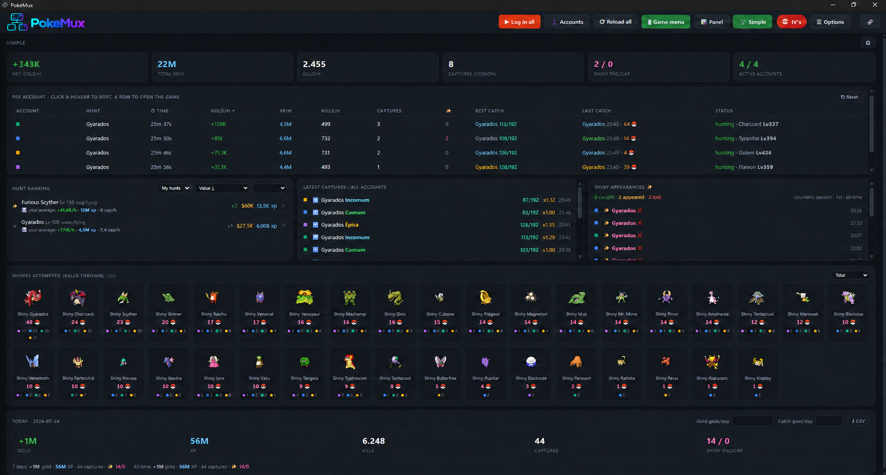

<div align="center">


# PokeGrid MultTela

**Até quatro contas de Poke Idle World em uma janela, com sessões isoladas e ferramentas locais.**


[](LICENSE)



</div>

> Projeto independente, sem vínculo com o Poke Idle World. O uso deve respeitar as regras atuais do jogo. CAPTCHA e 2FA continuam sempre manuais.

## Principais recursos

- De uma a quatro contas, com partições persistentes e isoladas.
- Login automático usando credenciais protegidas pelo `safeStorage` do Electron; não há fallback em texto puro.
- Painel, modo Simples, histórico, métricas de gold/XP/kills, overkill, ETA, melhor hunt, tierlist e Ditto.
- Alertas de shiny por popup, som, Windows e Discord, com captura local opcional da tela do shiny.
- Overlay flutuante somente-leitura, individual ou agregado.
- Compra de Pokébolas em ação única, com confirmação de conta, tipo, quantidade, custo e saldo.
- Retorno experimental à mesma hunt após recarga, desligado por padrão, limitado a três tentativas espaçadas.
- Atualizações consultadas no máximo uma vez por dia, com changelog antes do download e confirmação separada para baixar e instalar.

O PokeGrid MultTela não carrega userscripts arbitrários e não inclui refill, venda, rotação de hunts ou ações repetitivas. As únicas ações de jogo mantidas são o login preenchido localmente, a compra confirmada de Pokébolas e o retorno experimental à mesma hunt.

## Instalação no Windows

Baixe o instalador x64 na [página pública de releases](https://github.com/Diego-ops501/PokeGrid-MultTela-Releases/releases). A primeira versão não possui assinatura de código, então o Windows SmartScreen pode pedir confirmação. O instalador já inclui o runtime necessário: o usuário não precisa instalar Node.js.

As configurações e o histórico ficam no perfil do Windows e são preservados em atualizações e reinstalações. Senhas protegidas pelo Windows não devem ser copiadas para outro computador.

## Rodar a partir do código

Para desenvolvimento, instale Node.js LTS e execute:

```powershell
npm ci
npm test
npm start
```

Para gerar o instalador NSIS x64:

```powershell
npm run dist
```

## Segurança

- O limite de quatro contas é validado no renderer e no processo principal.
- Cada conta usa uma partição persistente própria; as janelas locais usam `contextIsolation`, sandbox e Node desativado.
- Navegação dos painéis fica restrita ao domínio oficial do jogo; links externos abrem no navegador padrão.
- Credenciais são criptografadas via DPAPI no Windows e gravadas atomicamente, sem aparecer em logs ou exportações.
- O download de atualização só aceita o canal público configurado e a integridade é validada pelo SHA-512 do manifesto.

## Documentação

- [Manual](MANUAL.md)
- [FAQ](FAQ.md)
- [Histórico de mudanças](CHANGELOG.md)
- [Avisos e créditos](NOTICE.md)

## Créditos e licença

Este projeto deriva de [`soufoka/PokeGrid-source`](https://github.com/soufoka/PokeGrid-source), preservando seu histórico, licença MIT e créditos. Alterações do PokeGrid MultTela também são distribuídas sob a [licença MIT](LICENSE).
